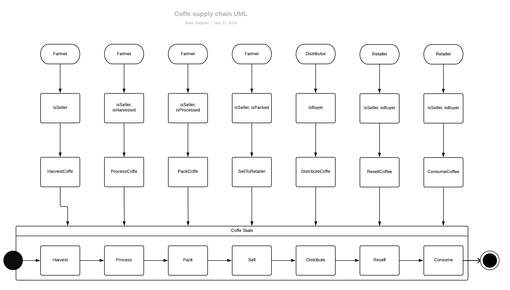

# FT-Coffee

FT-Coffee is a supply chain DApp, that demonstrates a Coffee Supply Chain flow between a farmer to consumer. A farmer can add items to the inventory system stored in the blockchain for each step like harvest, pack... A distributor can buy those item to the farmer.Then a retailer can receive it. After that a consumer can purchase such items from the retailer. Additionally anyone can track the recorde of the item.

## Preparation 

## Contract Address

0x233710Fc29Be5d40506fF629fD3BD538530C0Ce6

## Built With

Ethereum - Ethereum is a decentralized platform that runs smart contracts
Truffle Framework - Truffle is the most popular development framework for Ethereum with a mission to make your life a whole lot easier. v5.0.17 (core: 5.0.16)
Node - v8.11.2
